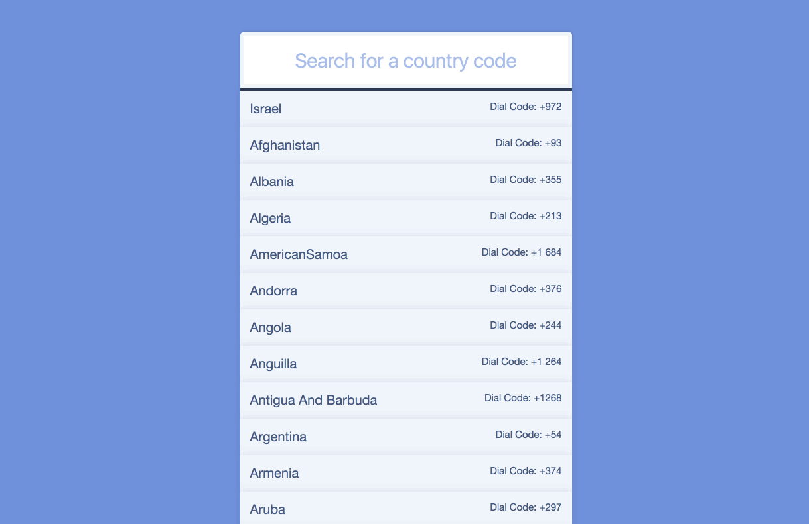

## Fetch Ajax data and filter it

**This concept demonstrates getting json data from an API and then using ES6 functions to filter the data to a desired result**

**This project uses ES6, so it only works in Chrome.**
To make it work in most browsers you need to change arrow functions into ES5 functions or transpile the code with something like Webpack or Gulp.
